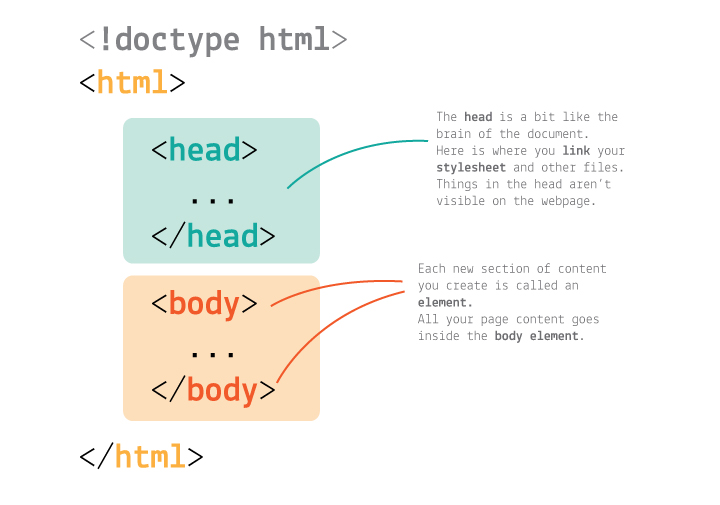
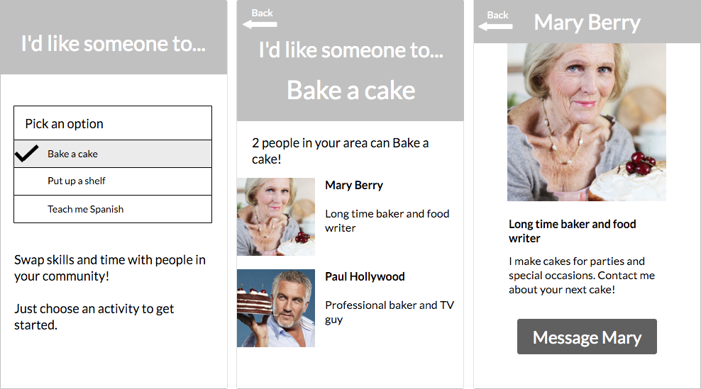

# HTML crash course

We're going to learn how to:

* Write HTML to **structure** a web page or app
	* Create several types of **text** (paragraphs, headings)
	* Create a HTML CV
	* Create **inputs** (dropdowns, buttons, text boxes)
	* Create **links** to other Web pages
	* Add **images**
	* Start a joint web development brief

## Step by step

### Content first, style later!

It's good practice to build the **HTML** first, and then make it _stylish_ with CSS.

#### HTML basics

HTML is a *markup* language, which you use to *format your content*.

Essentially, you wrap content inside bits of code called tags.

`<tag> content </tag>`

The bits of code inside angle brackets `<` and `>` are instructions for the computer:

* They describe the content they wrap
* Define where it starts `<tag>`
* Define where it ends `</tag>`

For example, this is how you wrap a paragraph of text in `p` tags:

`<p> This is a paragraph. </p>`

`p` stands for *paragraph*, of course.

## Excercise - Your CV

We're going to create a HTML version of your CV, you can use this to send off to potential clients or employers later on.
1. Create a new folder and name it cv
2. Create a file named `index.html`
3. Create a `styles.css` file
4. Paste the content of https://github.com/twoofthree/twoofthree.github.io/blob/master/demo-cv/styles.css into your styles file.


### HTML skeleton

Every HTML document, at the bare bones, needs to have this structure.

<!--
```html
<!doctype html>
<html>
	<head>
		...
	</head>
	<body>
		...
	</body>
</html>
```
-->



#### Head

> In the `head` edit your app `title` by changing the text in between the `<title> ... </title>` tags.

What you put in the `head` is not visible to the user.

Later, you'll add links to external resources like *stylesheets* and *meta* information.

#### Body

In the `body` you will put all the **interface elements** that are visible to the user.


## Let's start building

### Header/main/footer

You can use the `<header></header>` tag to identify an area as the header of the document/component. You can also use `<main></main>` to contain the main sections of your page and `<footer></footer>` to place a footer.

> Inside the `body`, add in a `<header>` element

```html
<body>
	<header>

	</header>
</body>
```
> Inside the header place a div and give it a class attribute of `container`

```html
<div class="container">

</div>
```

> Inside there create two divs, one will be the left hand side one will be the right

```html
<div>

</div>
<div>

</div>
```

Div's are devision tags, they are used to devide up content on your page and will tend to be the main HTML element you use to create blocks.

### Headings


> Inside the first div, write two titles a `<h1>` and a `<h2>`

```html
	<h1>Your name</h2>
	<h2>Your job title</h2>
```

### Paragraphs

> Write a paragraph to contain your contact information, add `<br />` tag to break to a new line

```html
<p>

</p>
```
`p` is for *paragraph*

### Sections

Sections are good to seperate your content into blocks.

> Add a `<main>` element, then add a `section` in the main

### Add your Experience

> Using h2, h3, h4 and p tags add your experience


### Lists

In a new section titled skills Add a list of your skills, there are two types of Lists:
* Odered `<ol></ol>`
* Unordered `<ul></ul>`

> Create an unordered list and add some items to that list to describe your skills, each list item is added using `<li></li>`

```html
<ul>
	<li>List item 1</li>
	<li>List item 2</li>
	<li>List item 3</li>
</ul>
```

> Finish your CV off with another section titled 'education' this will contain information about your education

# Excercise 2 - Our first web app



How do you explain what an app is to someone or something who's never seen/used one, like an *alien*?

### What is an app, then?

There is no clear-cut definition of *app*.

For the sake of this course, we like to think of apps as small **digital tools** that are **connected** to the Web.

To use an analogy, if the internet is like a *library* an app is like a *ladder*, which you use to help access specific books. In this case books are like websites, or web services such as databases.

Apps generally have a specific function, or a small set of functions. They are not trying to do everything.

This is *not* a good app. It is not **usable**, even though all the tools it features could be usable (and possibly useful) on their own.

Good apps do **one thing**, and do it well.

## The brief

We've been asked by a client to make a one page web app:

* Intro, logo, title, description
* Dropdown and button to filter some data
* Display a list of that data on click of button

## More HTML

Let's open our index.html file in the root of our repo, if you haven't created this yet, let's create a new file and name it `index.html`

Let's grab the starting document html and paste it into our index file:

https://github.com/twoofthree/twoofthree.github.io/blob/master/Resources/starting-page.html

### Dropdown

This is the first interactive element of your app.

It's a set of `options` that people can choose from.

> Under your headings, add in a `<select>` element. Inside that, add in some `<option>` elements.

```html
<section>
	...
	<select>
		<option>Keep my pet</option>
		<option>Bake a cake</option>
		<option>Move my piano</option>
	</select>
	...
</section>
```

### Button

> Next you'll need a `Find` or `Search` button. What do you think is the HTML code to make a button?

> It's `<button>` :)

```html
<section>
	...
	<button>Find</button>
	...
</section>
```

### Hyperlinks


You can add **hyperlinks** to our content using the `a` element.

```html
<a href="http://example.com"> the clickable text </a>
```

`a` is for *anchor* :anchor:

> Add in a little credit at the bottom of your page, just above the closing `</body>` tag.

```html
	...
	<p>Made with love by <a href="http://example.com"> Your Name</a></p>
</body>
```

### Fancy logo


It's important. We recommend [hipsterlogogenerator.com](https://www.hipsterlogogenerator.com) for quick and easy hipster logos :)

> Take a couple of minutes to quickly make your own fancy logo.

> To place your logo in your HTML document create an `img` element inside the first `section`. `img` elements don't need closing tags (it's one of the exceptions to the general rule of closing tags).

```html
<section>
	
</section>
<section>
...
</section>
```

Every `img` requires a link - either a weblink to the image or the location of the image you're using in your files.

> In Thimble, upload your logo and put the name inside `src=" "`

```html
<section>
	
</section>
<section>
...
</section>
```

If you're taking an image from the web you need to use the link to the image alone.

> Right-click on the image and `Copy Link Address`. Then paste it inside `src=" "`

```html
<section>
	
</section>
<section>
...
</section>
```

Don't worry just now if it's too big, we'll resize it later on.


# If there's extra time

If there's extra time, let's go back to our CV and add a profile image. We can even have a sneak peak at some CSS and learn how to resize it and add some padding

### License

[](http://creativecommons.org/licenses/by-nc-sa/4.0)

This work is licensed under a [Creative Commons Attribution-NonCommercial-ShareAlike 4.0 International License ](http://creativecommons.org/licenses/by-nc-sa/4.0)
