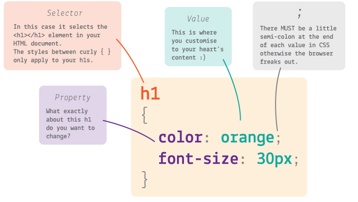

# CSS Crash Course

## Index

* CSS basics
* CV Styling Exercise
* Begin creating elements for our group app project

Now the stylish part: **CSS**!

## CSS basics

You use CSS to style HTML.

CSS looks and works differently than HTML.

```css
selector
{
	property: value;
	property: value;
}
```

The part before the curly brackets `{` and `}` is the **selector**. This ***selects*** the element from your HTML document.

In CSS you can select multiple HTML elements in one go.

For example, to select all paragraphs you can write

```css
p
{
	/* your styles for paragraph here */
}
```

CSS **properties** define how HTML elements are displayed.



The first bit is the property name, eg `color`, and the second bit is the value, eg `green`. They are separated by a `:` colon, and you MUST end each line of CSS with a `;` semicolon (for real, otherwise your browser will choke).

For example ...

```css
p
{
	color: green;
}
```

... will turn *every* paragraph in your HTML green.

### Hex colours

Colours in CSS are identified by either using the name of the colour eg `red` or by using a *hex code*. Hex codes are colour codes that identify a specific colour tone of a colour. eg `#ff0000` will return a red colour.

You can use a colour wheel to find your hex code, a useful one can be found at [Paletton](http://paletton.com/#uid=1000u0kllllaFw0g0qFqFg0w0aF).

### Play around a bit

Let's go back to our HTML cv's, try changing the css around a bit, customize the colors, fonts and borders to get familiar with CSS:

Create a new css file in the root of your repo, and name it `styles.css`.

Let's add a `link` to the `head` of your app which points to that CSS file called **styles.css**. This is where you add your own styles.

```html
<link rel="stylesheet" href="css/styles.css">
```

You can have more than just one CSS file, and we'll show you how it's good practice to work on several small files rather than one long document you may get lost into.


> Let's spend the next 5-10 minutes getting familiar with CSS. It doesn't matter if your app looks a bit funny for now. Things you can do:

> * change the `color` of your `h1` or `h2` elements
> * align some elements to the `center` (*google* how to do it)
> * hide some elements
> * change the `background-color` of the whole page

> What else would you like to do? Try and *google* it first, then we can do it together (if it's not too whacky).

### Search for solutions!

Part of learning to code and being a coder is searching for answers, every day. You don't need to remember everything and you don't need to learn everything immediately.

**All the answers can be found on the Web! As coders, we must get used to searching online for solutions.**

### Inspect websites you like

Did you know, you can see the code which has created every site on the Web? You can use the **Web Inspector** to do this. It's like x-ray specs for websites.

> Go to a website (any website) and right-click anywhere on that page, then select `Inspect` (or `Inspect Element` in some browsers).

On the **left panel** of the `Elements` tab you can see all the HTML code for the page you're inspecting. By clicking on an HTML element you'll reveal all the CSS applied to it, on the **right panel**.

You can also play with this code and change the way your favourite websites look (but don't worry, your changes won't affect how other people are experiencing that site). :scream:

> Go to a site you like, right-click > `Inspect` and then see if you can find which colours it uses.

### Fonts

Text is the major carrier of information on an app, so it's good practice to start with **typography**, or *type setting*. That means defining how texts are going to look, which fonts your app is going to use, and the proportions between them in your app layout.

> You can grab a free **font** from [Google Fonts](https://fonts.google.com/):

> 1. Pick a typeface you like
> 2. Click on the red `+` button (in the top right corner of the selected font)
> 3. Toggle the `family selected` box (black bar at the bottom)
> 4. Copy and paste the `embed code` into your Thimble (between your <head> tags)

>	Where? Before `style.css`

```html
	<head>
		...
		<link href='https://fonts.googleapis.com/css?family=Lato:400,300,700,900' rel='stylesheet' type='text/css'>
		<link rel="stylesheet" href="css/style.css">
	</head>
```
> * In `style.css`, define the font for the `body` element (all other elements will inherit it).

```css
body
{
	font-family: 'Lato', sans-serif;
}
```

We're using the font *Lato* as an example, but you can pick **whichever font** you like and change your CSS code accordingly. There are more than 700 fonts available on Google Fonts!

Then you can set **more specific rules** for headings, paragraphs and bold elements. For instance, you could use a different font just for headings, as well as changing many other aspects of your typography:

* `font-family`
* `font-size`
* `font-weight`
* `font-style`
* `line-height`
* `letter-spacing`
* `word-spacing`
* `text-align`
* `text-decoration`
* `text-transform`
* `text-indent`

> `font-family`, `font-size` and `color` are a great place to start!

### Background images

You can add images to your app via CSS. This is useful if you want to set different images for different screen sizes (eg: one for mobile, a different one for tablets) as well as fine-tuning how your images should display.

> In your `style.css` create a new `background-image` rule for `html`

```css
html
{
	background-image: url('');
}
```

You can upload your own image files to Thimble (if they're smaller than 3MB), or use image links from the Web (provided they're licensed for re-use).

For now, we'll use [Stock Snap](https://stocksnap.io/), where you can find beautiful, high-res pictures that are free to use for *whatever* purpose you want. Amazing!

> 1. Find an image you like on [Stock Snap](https://stocksnap.io/)
> 2. Secondary click on the image. (Right click for PC, Two finger click for Mac)
> 3. **Copy Image Address**. This should copy the images URL to your clipboard. Paste it into a new tab if you don't believe me.
> 4. **Paste** it in your `style.css` inside the `body` `background-image` rule like so

```css
html
{
	background-image: url('assets/example.jpg');
}
```

By default background-images *tile*, but we want them to take up the whole available screen space, without losing their aspect ratio (no squashing). 

We can achieve that with `background-size`. This property can take various values: pixel sizes, percentages, and then a couple of interesting keywords.

* `contain` will scale the image so as to be as large as possible providing that it is **contained** within the background positioning area. 
* `cover` instead, will scale the image, this time to be as large as possible so that the background positioning area is completely **covered** by the background image.

> Add `background-size: cover;` to the `html` rule.

```css
html
{
	background-image: url('assets/example.jpg');
 	background-size: cover;
}
```

Now the image *covers* the content of your app, ie the `body` but you have probably noticed that it doesn't cover the *whole browser window*. The last touch we can add to the background image, to make it cover the whole browser window is adding `background-attachment: fixed;`

```css
html
{
	background-image: url('assets/example.jpg');
 	background-size: cover;
 	background-attachment: fixed;
}
```  


* CSS **comments**

* Style `select` and `button`
	* `border: none;`
	* `border-radius`
	* `margin`
	* `padding`
* Colours
	* Web inspector colour picker (maybe pick a colour from Facebook). Everything is lost on *page refresh* so need to copy-paste into our code.
	* `background`
	* `color`
	* `border-color`
	* Check out [Kuler](https://color.adobe.com) and/or [Flat UI colors](https://flatuicolors.com/) for inspirations


* Icons using [FontAwesome](https://fortawesome.github.io/Font-Awesome/)

	```css
	.dropdown
	{
	  position: relative;
	}
	.dropdown:after
	{
	  content: "\f063";
	  font-family: FontAwesome;
	  position: absolute;
	  top: .75em;
	  right: .75em;
	  font-size: 2em;
	  pointer-events: none;
	}
	```

* Make the app look proper on a phone. Google `how to stop phone zooming out pages`

* Make the app **full screen**. Google `how to hide address bar in mobile browser` and you should find [this tutorial](http://www.html5rocks.com/en/mobile/fullscreen/)

* Add the app to your phone's **home screen**

	`<link rel="apple-touch-icon" href="blabla.png">`

* Transparency?

* Take inspiration from these fancy demos by Codrops:
	* [Custom select elements](http://tympanus.net/codrops/2014/07/10/inspiration-for-custom-select-elements/)
	* [Minimal form interface](http://tympanus.net/codrops/2014/04/01/minimal-form-interface)
	* [Natural language form](http://tympanus.net/codrops/2013/05/21/natural-language-form-with-custom-input-elements)

## Thinking inside the **box**

Imagine that there is an **invisible box** around *every* HTML element.

Your browser likes to put code into boxes, boxes inside boxes inside boxes inside boxes...

Each HTML box has:

* `margin` (outside)
* `border`
* `padding` (inside)


<!-- You can use pesticide.io to demonstrate this -->

### Styling interactive elements

#### Dropdown

To style your dropdown, you first need to know how it's called in HTML: `select`

> In `style.css` add a new CSS block

```css
select
{
	background-color: red;
}
```

This will turn your dropdown's **background** red. Go ahead and change that to your favourite colour.


> Remember how to change the **colour of texts**? It's `color` :us:

```css
select
{
 	background-color: red;
 	color: white;
}
```

Last week you integrated a font from [Google Fonts](https://www.google.com/fonts) into your app, which turned everything into your chosen font. Or did it?

The dropdown and buttons are still in the standard browser font.

> How do you **change the font** of your dropdown? It's `font-family`

```css
select
{
 	background-color: red;
 	color: white;
 	font-family: 'Lekton'; /* 'Lekton' is our favourite font, you choose your own from https://www.google.com/fonts */
}
```

Currently the dropdown looks too small and its text is not **comfortable to read**. How do you fix that?

```css
select
{
 	...
 	font-size: 200%;
}
```

> Adjust the `font-size` to suit your app content.

Btw `px` stands for *pixels*, which are the little dots that make up the screen. If you go close enough to your computer screen, you'll start seeing the pixels.

### Button

> Add a new CSS block that targets the `button`

```css
button
{
 	border: none;
 	background-color: red;
 	cursor: pointer;
}
```

> Change the `color` to match your design.

It's good practice to style all *interactive* interface elements the same **colour and prominent**.

Now you can apply some of the styles from the dropdown to the `button`.

> How do you make **rounded corners**? With `border-radius`.

```css
button
{
 	...
	border-radius: 10px;
}
```

Nice. It looks a bit squished though. We can use `padding` to add some space between the button text and its border.

```css
button
{
	...
   	padding: 10px;
}
```

#### Button states

As an interactive element, a `button` should respond to user interactions, through its look & feel.

For example, when you roll over a button, it's good practice for it to change its appearance, acknowledging that *something is happening*.

> Add a new CSS block that targets the `hover` state of your `button`

```css
button:hover
{
 	color: black;
}
```

Now when you roll over the button, its text will turn black.

#### Smooth transitions

Currently the text colour flashes from the normal state to the `hover` state.

> You can make that transition smooth using the `transition` CSS property

```css
button
{
 	transition: 0.6s;
}
```

`s` stands for seconds.


## Excercise 2

> Style the elements of your app using the knowledge learned above

### License

[](http://creativecommons.org/licenses/by-nc-sa/4.0)

This work is licensed under a [Creative Commons Attribution-NonCommercial-ShareAlike 4.0 International License ](http://creativecommons.org/licenses/by-nc-sa/4.0)
